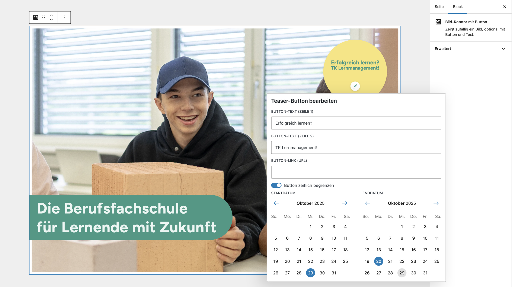

# UD Block: Image Rotator

Ein Block zur Anzeige von wechselnden oder zufälligen Bildern – optional mit Text und Button.
Ideal für visuelle Highlights, Banner oder saisonale Aktionen, die sich automatisch austauschen lassen.

---

## Funktionen

- Zeigt ein zufälliges oder festes Bild aus einer definierten Liste
- Optionaler Text und Button unter dem Bild
- Zweizeilige Button-Beschriftung möglich
- Zeitsteuerung über Start- und Enddatum (z. B. für saisonale Inhalte)
- Serverseitige Ausgabe mit Fallback, falls kein Bild aktiv ist
- Kompatibel mit Full Site Editing (FSE)

---

*Abbildung: Editor-Ansicht*

*Abbildung: Editor-Ansicht*

## Attribute

| Attribut | Typ | Beschreibung |
|-----------|-----|--------------|
| `images` | array | Liste der verfügbaren Bilder |
| `text` | string | Optionaler Beschreibungstext |
| `buttonUrl` | string | Ziel-URL des Buttons |
| `buttonLabelLine1` | string | Erste Zeile der Button-Beschriftung |
| `buttonLabelLine2` | string | Zweite Zeile der Button-Beschriftung |
| `enableDateRange` | boolean | Aktiviert die Zeitsteuerung |
| `startDate` | string | Startdatum der Anzeige |
| `endDate` | string | Enddatum der Anzeige |

---

## 🖥️ Verwendung

1. Im Editor den Block **„Bild-Rotator mit Button“** hinzufügen.
2. Eine oder mehrere Bilder auswählen.
3. Optional Text und Button-Beschriftung ergänzen.
4. Falls gewünscht, Zeitraum für die Anzeige aktivieren.
5. Im Frontend wird automatisch ein passendes Bild angezeigt.

---

---

## 🪪 Lizenz

GPL v2 or later
© ulrich.digital gmbh – [https://ulrich.digital](https://ulrich.digital)
